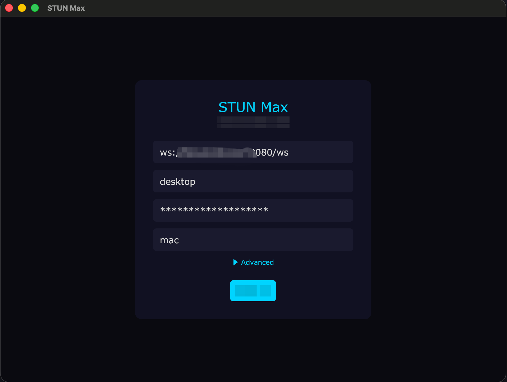
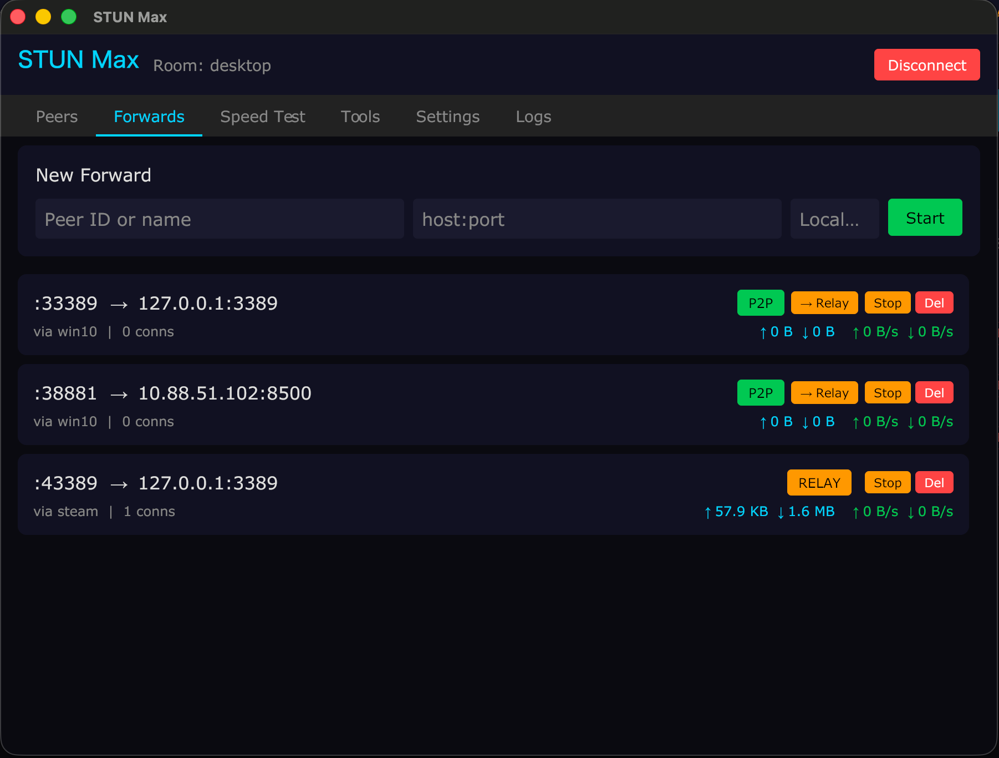

# STUN Max

P2P tunnel system with STUN hole punching and automatic server relay fallback. Encrypted, cross-platform, GUI + CLI.

## Architecture

```
┌──────────┐       UDP hole punch        ┌──────────┐
│ Client A │◄═══════════════════════════►│ Client B │
│ (GUI/CLI)│    X25519 + AES-256-GCM     │ (GUI/CLI)│
└────┬─────┘                             └────┬─────┘
     │  WebSocket (signaling + relay)         │
     └──────────────┬─────────────────────────┘
                    │
             ┌──────┴──────┐
             │   Server    │
             │ Signal+Relay│
             │ + Dashboard │
             └─────────────┘
```

- **P2P first**: STUN hole punch → UDP direct connection (encrypted)
- **Auto fallback**: If punch fails → WebSocket relay through server
- **Encrypted**: X25519 ECDH key exchange + AES-256-GCM on P2P channel

## Quick Start








### 1. Deploy Server

#### Quick Run (test)

```bash
./build.sh
./build/stun_max-server-linux-amd64 --addr :8080 --web-dir ./build/web
# Password printed to console
```

#### Production Deploy (systemd)

Upload binaries to your server:

```bash
# Build on local machine
./build.sh

# Upload
scp build/stun_max-server-linux-amd64 root@YOUR_SERVER:/usr/local/bin/stun_max-server
scp build/stun_max-stunserver-linux-amd64 root@YOUR_SERVER:/usr/local/bin/stun_max-stunserver
ssh root@YOUR_SERVER "mkdir -p /opt/stun_max/web"
scp -r build/web/* root@YOUR_SERVER:/opt/stun_max/web/
```

Create systemd service for the signal server:

```bash
cat > /etc/systemd/system/stun-max.service << 'EOF'
[Unit]
Description=STUN Max Signal Server
After=network.target

[Service]
Type=simple
ExecStart=/usr/local/bin/stun_max-server --addr :8080 --web-dir /opt/stun_max/web
WorkingDirectory=/opt/stun_max
Restart=always
RestartSec=3
LimitNOFILE=65536

[Install]
WantedBy=multi-user.target
EOF

systemctl daemon-reload
systemctl enable stun-max
systemctl start stun-max
```

View the auto-generated dashboard password:

```bash
journalctl -u stun-max | grep Password
```

Optional: deploy STUN server (improves hole punch success, especially in China):

```bash
cat > /etc/systemd/system/stun-max-stun.service << 'EOF'
[Unit]
Description=STUN Max - STUN Server
After=network.target

[Service]
Type=simple
ExecStart=/usr/local/bin/stun_max-stunserver --addr :3478
Restart=always
RestartSec=3

[Install]
WantedBy=multi-user.target
EOF

systemctl daemon-reload
systemctl enable stun-max-stun
systemctl start stun-max-stun
```

#### Firewall

Open these ports on your server:

| Port | Protocol | Service |
|------|----------|---------|
| 8080 | TCP | Signal server (WebSocket + Dashboard) |
| 3478 | UDP | STUN server (optional) |

```bash
# UFW
ufw allow 8080/tcp
ufw allow 3478/udp

# Or iptables
iptables -A INPUT -p tcp --dport 8080 -j ACCEPT
iptables -A INPUT -p udp --dport 3478 -j ACCEPT
```

#### Create a Room

Open `http://YOUR_SERVER:8080` in browser, login with the password, then create a room with a name and password. Clients must use the exact room name and password to join.

### 2. Connect Clients

**GUI** (Windows/Mac):
```
stun_max-client-windows-amd64.exe
stun_max-client-darwin-arm64
```
Fill in server URL, room name, password, your name → Connect.

**CLI**:
```bash
./stun_max-cli --server ws://YOUR_SERVER:8080/ws --room myroom --password secret --name laptop
```

### 3. Port Forward

Once two clients are in the same room:

```
# GUI: Forwards tab → enter peer name, host:port, click Start
# CLI:
> forward peer-name 127.0.0.1:8080
> forward peer-name 192.168.1.100:3389 3389
> forwards    # list active
> unforward 3389
```

### 4. NAT Diagnostic

```bash
./natcheck
```

Shows NAT type, hole punch success probability, compatibility matrix.

## Build

```bash
# All platforms
./build.sh

# Single target
go build ./server/                           # server
go build ./client/                           # GUI client
go build -tags cli ./client/                 # CLI client
go build ./tools/natcheck/                   # NAT checker
go build ./tools/stunserver/                 # STUN server
```

## CLI Commands

| Command | Description |
|---------|-------------|
| `peers` | List peers with P2P/RELAY status |
| `forward <peer> <host:port> [local]` | Forward remote port to local |
| `unforward <port>` | Stop a forward |
| `forwards` | List active forwards |
| `stun` | Show STUN/P2P status |
| `speedtest <peer>` | Run speed test |
| `help` | Show help |
| `quit` | Disconnect |

Tab completion supported for all commands, peer names, and port numbers.

## GUI Features

| Tab | Features |
|-----|----------|
| Peers | Live peer list, P2P/RELAY status, STUN endpoints |
| Forwards | Create/stop/delete forwards, real-time traffic stats, mode toggle |
| Speed Test | Upload/download speed test between peers |
| Tools | Windows RDP: enable/disable 3389 (localhost only), password management |
| Settings | Allow incoming forwards, local-only mode, autostart (Windows) |
| Logs | Scrollable event log |

## Server Dashboard

Web dashboard at `http://SERVER:PORT` (password protected):
- Room management (create/delete)
- Peer monitoring (status, endpoints, traffic)
- Traffic statistics per room

## Security

- Room isolation: clients can only communicate within the same room
- Room passwords: SHA-256 hashed, different passwords = different rooms
- P2P encryption: X25519 ECDH + AES-256-GCM (counter-based nonce)
- Dashboard: token-based session auth, 24h expiry, rate-limited login
- Relay isolation: server verifies sender and receiver are in the same room
- RDP tool: firewall restricts 3389 to localhost only (127.0.0.1)
- WebSocket: rate-limited connections per IP
- Forward access control: per-client allow/deny + local-only mode

## Server Flags

| Flag | Default | Description |
|------|---------|-------------|
| `--addr` | `:8080` | Listen address |
| `--web-password` | (random) | Dashboard password |
| `--web-dir` | `../web` | Web static files path |

## Client Flags (CLI)

| Flag | Default | Description |
|------|---------|-------------|
| `--server` | `ws://localhost:8080/ws` | Server WebSocket URL |
| `--room` | (required) | Room name |
| `--password` | | Room password |
| `--name` | (hostname) | Display name |
| `--stun` | `stun.cloudflare.com:3478` | STUN server(s), comma-separated |
| `--no-stun` | `false` | Disable STUN, relay only |
| `-v` | `false` | Verbose logging |

## Project Structure

```
server/          Signal server + relay + web dashboard
  main.go        HTTP/WS server, auth, rate limiting
  hub.go         Room management, peer tracking
  client.go      WebSocket message handling
  relay.go       Data relay with room isolation
  stats.go       Traffic statistics
client/
  core/          Networking core (shared by GUI + CLI)
    client.go    Connection, signaling, peer management
    tunnel.go    TCP port forwarding, P2P/relay data path
    stun.go      STUN discovery, UDP hole punch, key exchange
    crypto.go    X25519 + AES-256-GCM encryption
    speedtest.go Peer-to-peer speed testing
    types.go     Protocol types
    events.go    Event system for UI
  ui/            Gio UI (GUI client)
  main.go        GUI entry point
  main_cli.go    CLI entry point (build tag: cli)
web/             Admin dashboard (HTML/JS/CSS)
tools/
  natcheck/      NAT type diagnostic tool
  stunserver/    Lightweight STUN server
```
